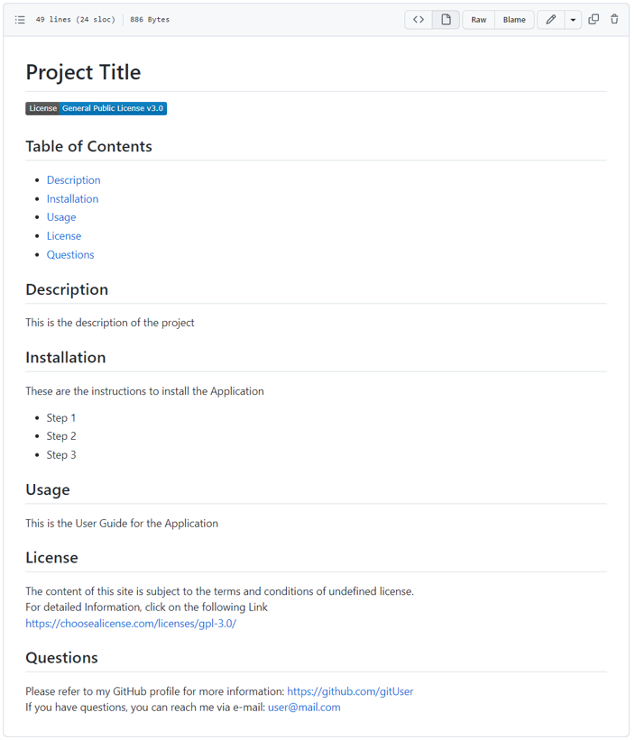
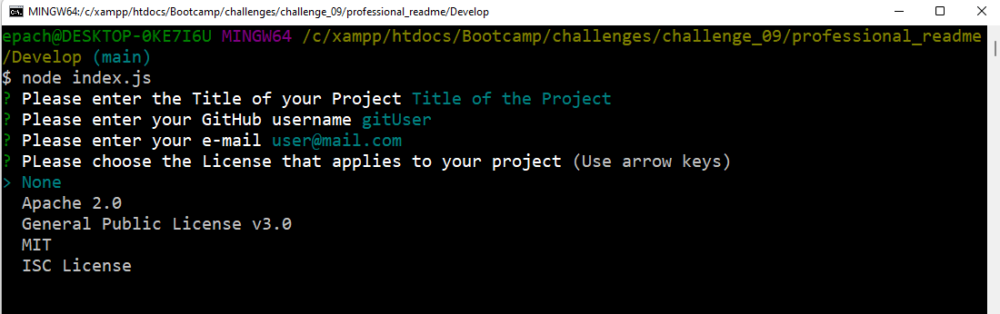
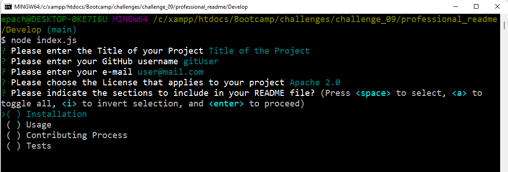
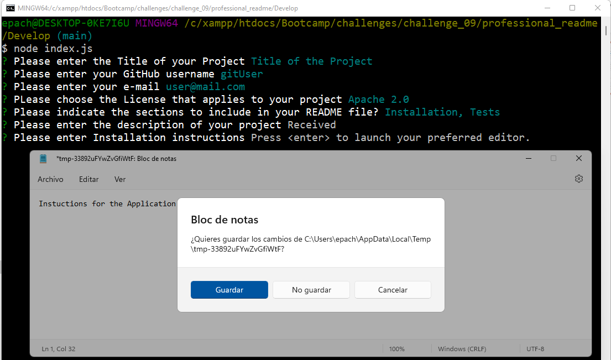

# Profesional README Dynamic Generator  

## Table of Contents
- [Description](#description)
- [Usage](#usage)  
- [Questions](#questions)  

## Description  

Professional README Dynamic Generator is an application that guides a user through the creation of an README file. The application considers the sections required for a professional README file; additionally it is already formatted, hence user is more concentrated on the content. 

## Usage  
    
  The application prompts a series of questions which the user has to answer. Questions are structured as follow
-	Basic Information: Title, GutHub User, Mail.

-	License: The user needs to specify if the README that is building for the application is covered under a license. 
  - ( ) Apache 2.0
  - ( ) General Public License v3.0
  - ( ) MIT
  - ( ) ISC

-	Sections to include: User needs to specify the sections to be included in the README
  - ( ) Installation
  - ( ) Usage
  - ( ) Contribution Process
  - ( ) Tests
For each of the sections selected by the user, he/she will be requested to describe the content. The default editor will open up so the user add the desired information. Once finished, the user only has to close the editor and select to SAVE changes when prompted.

-	Description of the Project: The User is required to write brief description of the project.

## Questions
Please refer to my GitHub profile for more information: https://github.com/Lalo79  
If you have questions, you can reach me via e-mail: lalo@mail.com   

